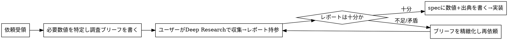

# Deep Research Intake

## 中核原則

このアプリの価値は **意思決定に効く具体数値を出典付きで正面から出すこと**（例: HAS-BLED 各点数の年間大出血率 %/年）。
だから臨床数値は **捏造しない・記憶で埋めない・「TODO/出典確認中」で濁さない**。
代わりに、ユーザーが ChatGPT Deep Research（Proプラン）で集めたレポートを経由して取り込む。
あなたの最初の仕事は実装でも数値の推測でもなく、**ユーザーに渡す調査ブリーフを書くこと**。

参照: メモリ `project_purpose.md` / `feedback_tone_audience.md`、`AGENTS.md` 絶対則。

## いつ使うか

- ユーザーが「こういうツールが欲しい」「この点数の発症率も出して」等を会話で言い、確定仕様書が無いとき
- 具体数値・較正済みアウトカム・施設外エビデンスが意思決定に必要なとき

使わない: 確定済み `docs/specs/<id>.md` がもうある（→ create-*-module スキルへ直行） / 数値を伴わない純粋なUI・リファクタ依頼。

## フロー



1. **依頼を構造化** — どのツール/改修か、どの数値が意思決定の substrate か（点数→%/年 等）を1〜2行で言語化。勝手に実装着手しない。Cowork へ回さない（このループはユーザーの Deep Research が担う）。
2. **調査ブリーフを書く**（下記テンプレ）。これを出して**ユーザーのレポート持参を待つ**。
3. **レポート受領 → 十分性を判定**。不足・コホート間矛盾・出典欠落があれば、papering over せず具体的に指摘してブリーフを精緻化し再依頼。
4. **十分なら spec を書く** — `docs/specs/<id>.md`（`TEMPLATE.md` 準拠）。数値は本文前面に、各数値に出典（著者・誌名・年・表/図）。専門家限定の内部ツールなので汎用ヘッジは足さない。ステータスは「下書き」で作成し、確定はユーザー判断（勝手に「実装済み」へ上げない）。
5. **実装へ連結** — 型に応じて create-calculator-module / create-document-module / create-checklist-module を起動。`npm test` / `npm run build` を通す。

## 調査ブリーフのテンプレート

ユーザーにそのまま Deep Research へ貼れる形で渡す:

```
# Deep Research 依頼: <ツール名/改修点>
## 必要なアウトプット（具体的に）
- <例: HAS-BLED 0〜9点それぞれの「年間大出血率(%/年)」を数値で>
- <例: 採用元コホートを明示（導出 Pisters 2010 か、検証コホートか）>
## 出典の要件
- 一次文献優先。各数値に 著者・誌名・年・該当する表/図番号 を付ける
- 数値がコホートで割れる場合は両方とその差の理由
## 既知の論点（あれば）
- <例: ワルファリン例 vs DOAC例で出血率が異なる点>
## 出力形式
- Markdown。数値は表で。末尾に references リスト
```

依頼に応じて項目は調整。要点は「曖昧な一般論ではなく**意思決定に使える粒度の数値と出典**を指定する」こと。

## よくある失敗（ベースラインで観測）

| 失敗 | 正しい挙動 |
|---|---|
| 記憶/推測で数値を仮実装 | 数値はユーザーの Deep Research 経由でのみ取り込む |
| 「TODO・出典確認中」で濁して実装を進める | 数値が無いなら実装せず調査ブリーフを出して待つ |
| Cowork に仕様書作成を回す | このプロジェクトの数値収集ループはユーザーの Deep Research。ブリーフを書くのは自分 |
| 調査ブリーフを書かず「どうしますか」と聞く | 具体的な必要数値・出典要件まで書いた実行可能なブリーフを出す |
| レポートが薄いのに spec を書き始める | 不足を具体指摘しブリーフを精緻化して再依頼 |
| spec を汎用ヘッジだらけにする | 専門家限定の内部ツール。数値前面・出典付き・断定可（`feedback_tone_audience.md`） |

## レッドフラグ（自己点検）

- 「とりあえず文献値で仮実装して出典確認中と書いておこう」
- 「Cowork で仕様書を作ってもらいましょうと返そう」
- 「数値の出どころはユーザーに聞けばいいから今は実装を進めよう」

いずれも **停止**。調査ブリーフを書いてユーザーのレポートを待つ。
